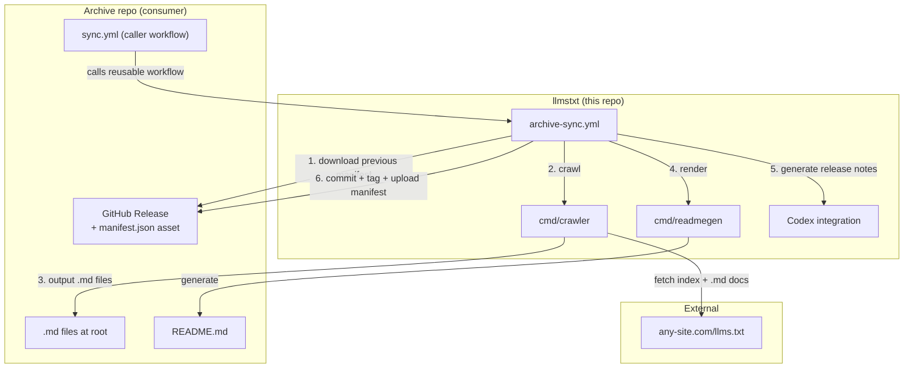

# llmstxt

Tooling for archiving documentation exposed via [`llms.txt`](https://llmstxt.org/) and tracking how it changes over time. Any site that publishes an `llms.txt` index can be archived.

## What this repo contains

| Component | Path | Purpose |
|-----------|------|---------|
| Crawler | `cmd/crawler/` | Fetches an `llms.txt` index and all linked `.md` documents |
| README renderer | `cmd/readmegen/` | Generates a README for archive repos from a Go template |
| Reusable workflow | `.github/workflows/archive-sync.yml` | End-to-end sync: crawl, diff, commit, release |
| Codex integration | `.github/codex/`, `.github/scripts/` | AI-generated release notes with hardened validation |
| CI | `.github/workflows/ci.yml` | Tests, linting, vulnerability scanning |

## Architecture



### How a sync runs

1. Archive repo's `sync.yml` triggers `archive-sync.yml` on a schedule (e.g. hourly)
2. Workflow downloads the previous `manifest.json` from the latest release (for conditional requests)
3. Crawler fetches `llms.txt`, discovers linked docs via BFS, downloads all `.md` files concurrently
4. Generated files are synced into the archive repo root via `rsync`
5. If content changed: Codex generates commit message and release notes
6. Workflow commits, tags, and creates a release with `manifest.json` as an asset

### Crawler features

- Parses both markdown-link and plain URL-per-line `llms.txt` formats
- BFS discovery of nested `llms.txt` indexes (capped at 50 to prevent runaway crawling)
- Concurrent fetching with configurable worker count and optional rate limiting (`-rate-limit`)
- Conditional requests via `If-None-Match` / `If-Modified-Since` using the previous manifest
- Retries transient HTTP errors (5xx, 429) with exponential backoff
- Response body size capped at 256 MiB per document
- HTTPS-only with SSRF protection (blocks private/loopback IPs, validates DNS resolution)
- Content validation: rejects `.md` URLs that return HTML (CDN error pages, login redirects)
- Atomic output staging with crash recovery journaling
- Preserves the previous archive copy when individual documents fail to fetch
- Structured logging via `log/slog`
- Two output layouts: `root` (flat) and `nested` (by host)

## Local usage

```bash
# Build
make build

# Crawl a site
go run ./cmd/crawler \
  -source https://example.com/llms.txt \
  -out /tmp/archive \
  -layout root \
  -manifest-out /tmp/manifest.json

# With rate limiting and cross-host support
go run ./cmd/crawler \
  -source https://example.com/llms.txt \
  -allowed-hosts docs.examplecdn.com \
  -rate-limit 5 \
  -out /tmp/archive \
  -layout root \
  -manifest-out /tmp/manifest.json

# Render a README
go run ./cmd/readmegen \
  -template templates/readme.md.tmpl \
  -out /tmp/README.md \
  -title "My Docs Archive" \
  -site-name "Example Docs" \
  -site-url "https://example.com" \
  -source-url "https://example.com/llms.txt" \
  -schedule-label "Hourly" \
  -document-count 42 \
  -skipped-count 3 \
  -releases-json releases.json
```

## Development

```bash
make check    # vet + test (race) + lint + govulncheck
make test     # tests only, with race detector
make build    # build both binaries to bin/
```

## Setting up a new archive repo

1. Create a new repo (e.g. `my-docs-archive`)
2. Add a caller workflow at `.github/workflows/sync.yml`:

```yaml
name: Sync
on:
  schedule:
    - cron: "42 * * * *"   # hourly
  workflow_dispatch:

jobs:
  sync:
    uses: llms-txt-archive/llmstxt/.github/workflows/archive-sync.yml@v1.0.0
    with:
      source_url: "https://example.com/llms.txt"
      site_name: "Example Docs"
      site_url: "https://example.com"
      repo_title: "Example Docs Archive"
      schedule_label: "Hourly at :42 UTC"
      tool_ref: v1.0.0
    secrets:
      OPENAI_API_KEY: ${{ secrets.OPENAI_API_KEY }}
```

3. Set the `OPENAI_API_KEY` secret (required for AI-generated release notes after the initial sync)
4. Optionally set `CODEX_MODEL` and `CODEX_EFFORT` repository variables to override Codex defaults

